<h1 align="center">Manualy — 社内マニュアル検索システム（RAG）<br>作品説明資料</h1>

とある企業で実際に使われている、**社内マニュアルをAIに質問して探せるWebアプリケーション**である。企画・設計・実装・クラウドへのデプロイ・運用・クラウド移行までを一人で行った。

| 項目 | 内容 |
|---|---|
| 氏名 | 木村 大暉 |
| 区分 | 個人開発（Webアプリケーション／実運用中） |
| ソースコード | https://github.com/mocaluna0117/manualy |
| 動作紹介動画 | `manualy-demo.mp4`（約3分40秒）<!-- 提出時にアップロード先のURLを記入 --> |
| 本番環境 | 社内限定・招待制のため公開不可（動画と下記の手順で確認いただけます） |

> 本番のマニュアルは社外秘のため、本資料の画面写真と動画はすべて、**デモ用に作った架空の会社・架空のマニュアル**で撮影した。アプリのコードは本番と同一である。

<p align="center">
  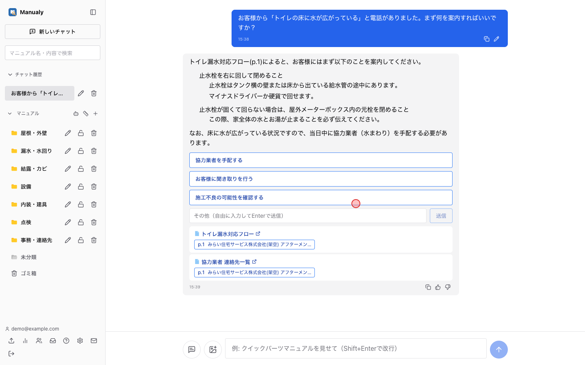
</p>

---

## 1. 制作意図

その企業の共有フォルダにはマニュアルが数百件あり、**「どれを読めばいいか分からない」「探すより人に聞いた方が早い」**という状態になっていた。電話でお客様対応をしながらフォルダを掘るのは現実的ではない。

そこで次の3つを目標にした。

- **知りたいことを日本語で聞けば、答えと「根拠のマニュアル・ページ」が返ってくる**こと（AIの答えを鵜呑みにせず、原本で確かめられる）
- **マニュアルに無いことは答えない**こと（業務でAIがもっともらしい嘘をつくのは、答えないより悪い）
- **使うほど良くなる**こと（答えられなかった質問を集め、次に書くべきマニュアルを見つけられる）

---

## 2. 開発概要（提出要項の必須項目）

| 項目 | 内容 |
|---|---|
| **開発期間** | 2026年6月〜9月（約3.5か月）。以降も運用・改修を継続中 |
| **所要時間（概算）** | 約110時間以上（コミット時刻から算出した作業時間の下限。設計・調査・動作確認を含めると更に多い） |
| **開発メンバー数・構成** | 1名 |
| **自身の担当範囲** | 全工程。現場からの要望の聞き取り、要件定義、技術選定、DB・API・画面の設計と実装、AWSへの構築、無料構成への移行、監視・バックアップの設置、利用者への展開と運用 |
| **動作環境** | モダンブラウザ（Chrome / Edge / Safari）。PC・スマートフォン両対応（ホーム画面に追加できるPWA）。サーバはクラウド上で稼働 |
| **操作方法** | ログイン後、画面中央の入力欄に質問を入力して送信する。左のサイドバーからフォルダ・マニュアルを閲覧でき、上部の検索欄でキーワード検索ができる。管理者はサイドバー下部からマニュアルの追加・利用状況の確認を行う（詳しくは「4. 主な機能」と動画） |
| **規模** | TypeScript（フロント 約14,800行・バックエンド 約14,900行）＋ Python（RAG 約6,500行）。コミット299件 |
| **利用状況** | 登録8名（うち日常的な利用は2〜3名）。マニュアル200件以上・検索用の文章片 約4,600件 |

---

## 3. 技術スタック

| レイヤ | 技術 |
|---|---|
| フロントエンド | React 19, TypeScript, Vite, Chakra UI v3, Apollo Client 4（PWA） |
| バックエンド | NestJS, **GraphQL（code-first）**, Prisma 7。回答のストリーミングのみ SSE |
| RAG（検索・生成） | Python, FastAPI |
| DB | PostgreSQL 16 + **pgvector**（ベクトル検索・HNSW索引）+ pg_trgm（部分一致の高速化） |
| AI | 埋め込み: bge-m3（1024次元）／ 生成: Gemma（回答・自動分類・スキャン画像の書き起こし・ツール呼び出し）。いずれも Cloudflare Workers AI |
| 認証 | Supabase Auth（JWT）＋ DB上のロール（管理者／一般） |
| インフラ | Cloud Run（backend・rag）, Cloud Tasks, Cloudflare Pages, Cloudflare R2, Supabase — **すべて無料枠（月額0円）** |
| 運用 | Cloud Monitoring（死活監視）, GitHub Actions（毎月のDBバックアップ・DB休止防止） |

### アーキテクチャ

<p align="center">
  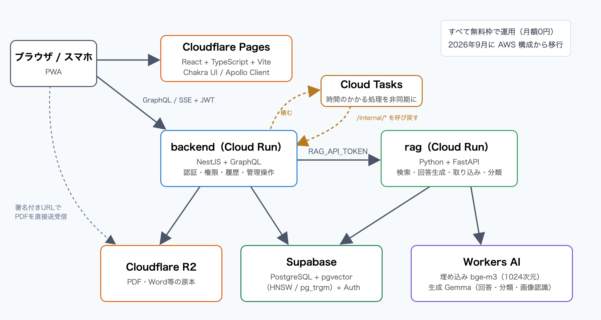
</p>

- **ブラウザからAI側（rag）を直接呼ばせない。** 認証・権限・履歴の保存はすべて backend で行い、rag は共有トークンが無いと応答しない（トークン未設定なら全部拒否する fail-closed）
- **PDFの中身は backend を通さない。** 署名付きURLでブラウザとストレージが直接やりとりするので、大きなファイルでもサーバのメモリを食わない
- **時間のかかる処理（取り込み・再分類）はキューに積む。** Cloud Run は応答を返した後の処理が保証されないため、Cloud Tasks から backend を呼び戻す形にした

---

## 4. 主な機能

### 探す

- **AIに質問（RAG）** … マニュアルの記述**だけ**を根拠に回答する。回答は生成されるそばから画面に流れる
- **根拠の提示** … 回答の下に使ったマニュアルとページが並び、押すとその場でPDFが開く
- **聞き返し・次の質問の提案** … 質問が曖昧なときは選択肢を出して絞り込む
- **画像を添えて質問** … 画面のスクリーンショットなどを4枚まで
- **キーワード検索** … 型番や電話番号のような文字列を部分一致で探す（AIとは別経路）

<p align="center">
  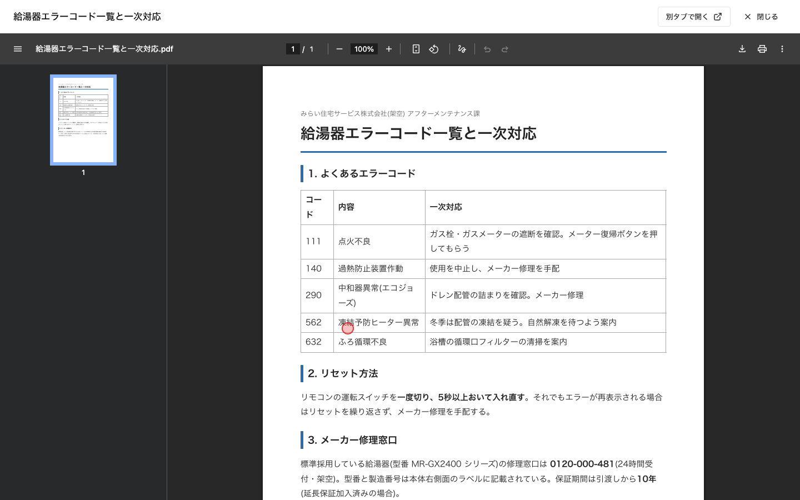
  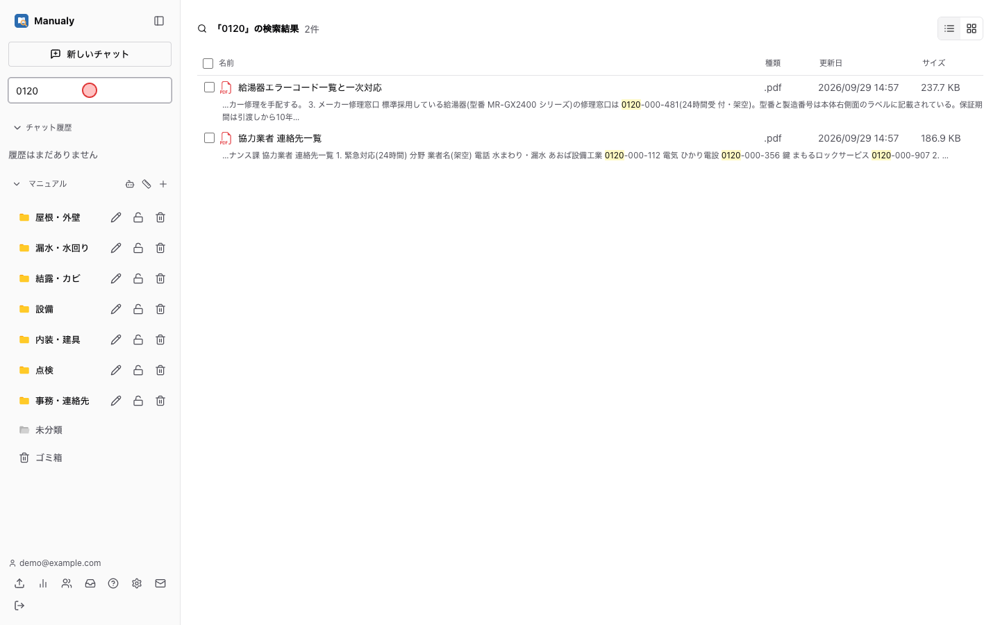
</p>
<p align="center">
  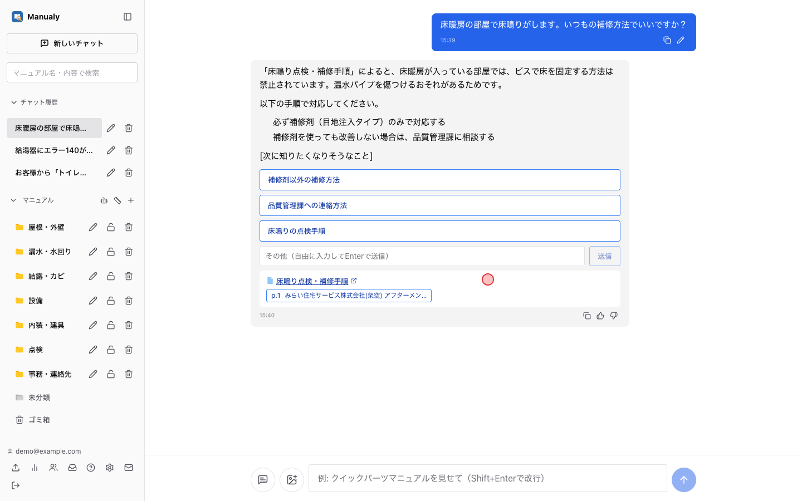
  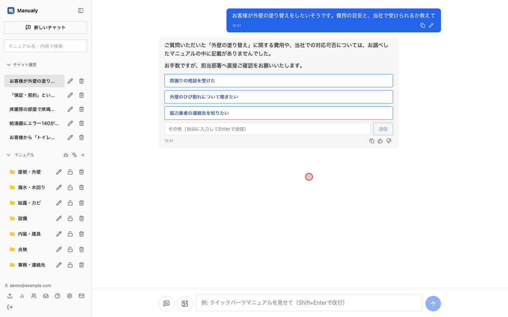
</p>
<p align="center"><sub>左上: 引用からPDFを開く ／ 右上: キーワード検索 ／ 左下: 例外の注意書きを拾う ／ 右下: マニュアルに無いことは「記載がない」と答える</sub></p>

### 貯める（管理者）

- **まとめてアップロード** … PDF / Word / Excel / PowerPoint / Outlookメール。中身を読み取って検索対象にする。文字の取れないスキャンPDFは画像認識で書き起こす
- **AIによる自動分類** … 内容を読んでフォルダへ振り分ける（合うフォルダが無ければ作る）。「床暖房関連はフローリングへ」のような分類ルールを覚えさせられ、再分類は元に戻せる
- **管理者だけに見せるフォルダ** … 一覧・検索に出さないだけでなく、**AIの回答の根拠にも使わない**
- **チャットで管理操作** … 「〇〇というフォルダを作って、鍵付きにして」のような指示を、AIがツール呼び出しで実行する

<p align="center">
  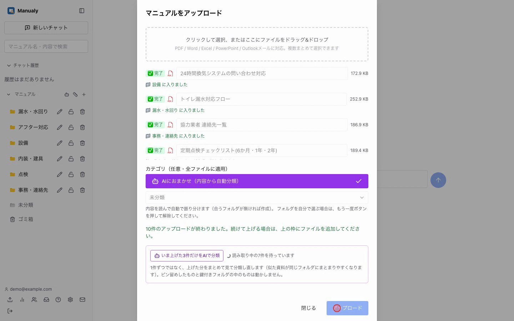
  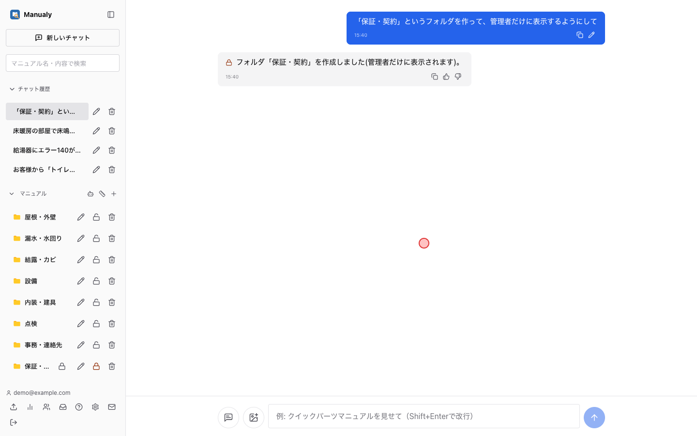
</p>

### 育てる（管理者）

- **利用状況** … 答えられなかった質問・よく聞かれること・マニュアルの使われ方
- **👍 / 👎** … 人の評価をAIの自己申告より優先して集計する
- **マニュアルの下書き生成** … 答えられなかった質問から、AIが章立てと分かっている範囲を書く。**分からない箇所は「(要確認)」で空けて、推測で埋めない**

<p align="center">
  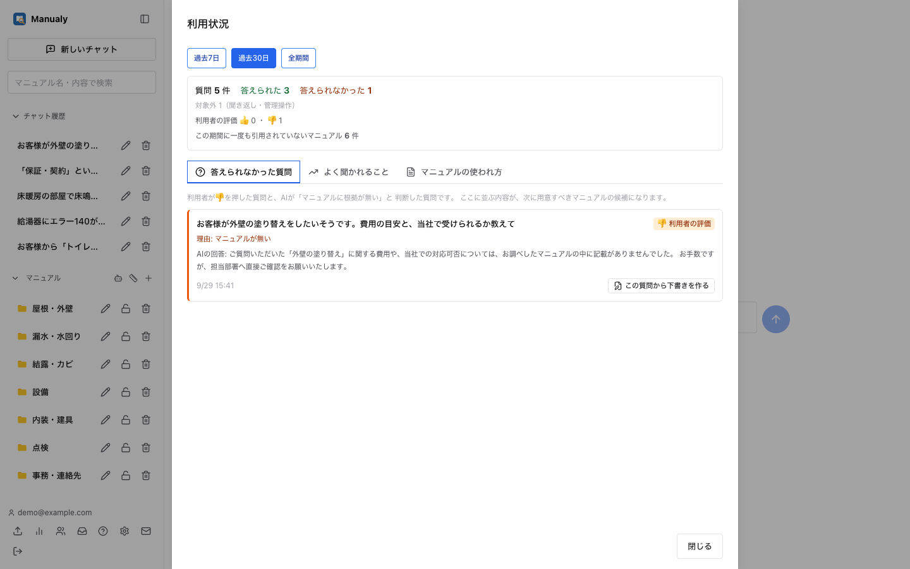
  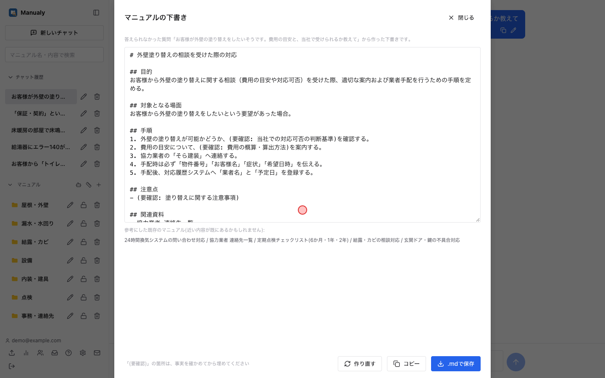
</p>

<p align="center">
  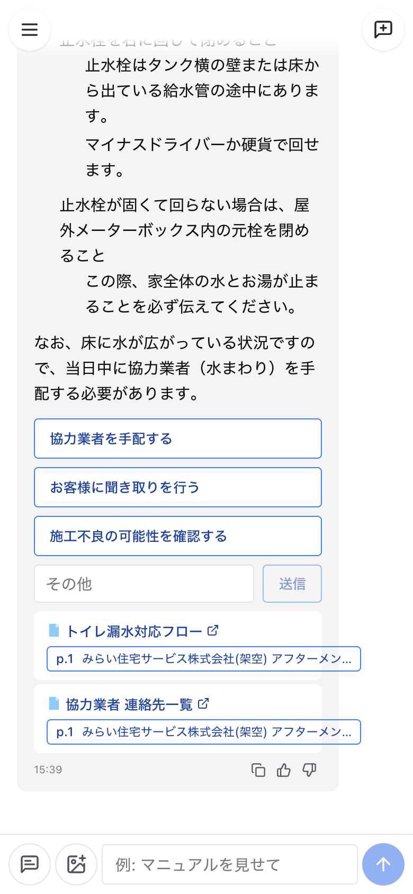
</p>
<p align="center"><sub>スマートフォンでの表示（現場で電話を受けながら使う想定）</sub></p>

---

## 5. 技術的に工夫した点

### (1) 検索の精度を「測って」上げた 📏

最初はベクトル検索（意味の近さ）だけだったが、実際の質問で試すと**型番や電話番号のような文字通りの一致に弱く**、記入見本のように**本文にほとんど文字が無い資料**はまったく出てこなかった。

- **3経路の検索を融合**した。ベクトル（意味）・キーワード（文字列の一致）・タイトルの3つで探し、**RRF（Reciprocal Rank Fusion）** で1本の順位にまとめる。`score = Σ 1/(60 + 各経路での順位)` で、複数の経路に出てくる資料ほど上に来る。経路ごとにスコアの尺度が違っても、**順位だけを使うので正規化が要らない**のがこの手法を選んだ理由である
- **評価用の質問セットを作り、変更のたびに Hit@1 / MRR を測る**ようにした（`rag/eval_search.py`）。「良くなった気がする」で判断しない
- 測る過程で、**タイトル検索が一部の資料で必ず失敗する**ことに気づいた。調べると、Macから上げたファイル名の約半数（39件中19件）が**Unicodeの正規化形式NFD**（「が」が「か＋濁点」の2文字になる）になっており、NFCで入力した検索語と一致していなかった。取り込み時と検索時の両方でNFCに揃えて解決した
- 埋め込みモデルを入れ替えた移行（後述）では、**移行前後で同じ評価を回して回帰が無いことを確認してから切り替えた**。結果は Hit@1 71%→79%、MRR 0.76→0.81 で、改善していた（本番データ・評価14問）

### (2) AIに「嘘をつかせない」ための設計 🛡️

業務で使う以上、AIがもっともらしい誤答をするのが一番まずい。仕組みの側で防いでいる。

- **抜粋に書かれたことだけで答えさせ、使った抜粋の番号を申告させる。** 画面の引用表示と「答えられたか」の集計はこの申告から作る
- **「実行したフリ」の検知。** チャットでの管理操作を作ったとき、AIが**ツールを呼ばずに「フォルダを作成しました」とだけ書く**現象が起きた。原因を調べると、会話履歴に残っていたシステムの成功メッセージをAIが真似していた。対策として、(1) 履歴からシステムの成功行を除いてからAIに渡す、(2) 「全マニュアルを再分類」のような重い操作は**確認ボタンを挟んでAIの判断を通さず決定的に実行**する、(3) 本文とツール呼び出しが食い違ったらシステムが訂正を追記する、の3段で防いだ
- **隠しフォルダは検索の段階で除く。** 画面の一覧から消すだけでは、**AIの回答を通して中身が漏れる**。実際、除外条件とキーワード条件がどちらも`OR`を含んでいたため、同じ階層に並べると後ろの条件が前を上書きし、**除外が黙って消えていた**。条件をAND句で包む形に直し、除外がテストで壊れないよう固定した

### (3) クレジット切れまでに、月額0円の構成へ移行した ☁️

最初は AWS（ECS Fargate・RDS・S3・CloudFront・Bedrock・Cognito）に構築したが、使っていたのは期限付きの無料クレジットで、**稼働させると1日約2.5ドル**かかり、残高が尽きると止まる。利用先の企業として課金するのは難しかったため、**機能を落とさずに月額0円で動く構成へ移す**ことにした。

- **移行先を比較**し、Cloud Run（米国）・Supabase・Cloudflare R2・Workers AI の組み合わせを選んだ。Cloud Run の無料の通信量は北米発だけが対象なので、**0.1〜0.2秒の遅延と引き換えに通信費を0にする**判断をした
- **差し替え口を先に作ってから移した。** 埋め込み・回答生成・認証・ストレージを環境変数で切り替えられる形にしておき、**AWS版を動かしたまま**新環境を組み立てた。切り替え当日のアプリの変更は設定だけで済んだ
- **手順書を作って実機でなぞり、当日止まる箇所を事前に潰した。** 実測では、DBの復元1分23秒、全4,577件の文章片の再ベクトル化18分7秒。予定より3日早く切り替え、翌日にAWSを完全に撤収した
- **無料枠の仕様を観測で確かめた。** AIの無料枠（1日10,000単位）は「毎日0時にリセット」と表示されていたが、実際に使い切ったとき**0時を過ぎても回復しなかった**。1時間ごとの使用量と回復した時刻を突き合わせ、**直近24時間の移動窓**で数えていると結論した。枯渇時の案内文も「回復時刻を約束しない」表現に直した
- 移行後に、**死活監視・毎月のバックアップ（復元できることも確認）・無料DBの休止を防ぐ定期アクセス**を設置した

### (4) 使う人を想定した細部 🧑‍🔧

- **スマホではPDFを別タブで開く。** スマホのブラウザは埋め込みPDFを1ページ目で描き止めるため
- **👍/👎を、AIの自己申告より優先する。** 「答えられた」かどうかはAI自身より利用者の方が正しい。どちらも無い場合は「判定できなかった理由」まで記録し、聞き返し・管理操作・生成失敗を「未判定」に混ぜない
- **隠しフォルダへ入れたら必ず画面で伝える。** 黙って入れると、一般利用者から見えなくなったことに誰も気づけない。伝える手段の無い経路（取り込みの数分後に走る自動分類）では、隠しフォルダを行き先にしない

---

## 6. ゲーム開発のプログラマとして活かせると考える点

Webアプリでありゲームとは領域が異なるが、以下は職種を問わず活かせると考えている。

- **「使う人」のための道具を作り、実際に使われるところまで持っていく力。** 貴社のシステムプログラマの業務にある「開発支援ツール」「大量のデータを扱うパイプライン」と同じく、この作品も**他の人の仕事を速くするための道具**である。現場の声を聞いて直し、利用状況のデータから次の改善を決めてきた
- **測って判断する姿勢。** 検索精度（Hit@1 / MRR）、移行作業の所要時間、無料枠の回復時刻など、「たぶん」で決めずに数値で確かめてから判断してきた。処理落ちやロード時間を詰めるゲームの最適化にも通じると考えている
- **壊れ方を想定して作る習慣。** AIのツール呼び出しの食い違い、条件式の優先順位による情報漏れ、移行時のデータ重複など、実際に起きた問題を原因まで追い、同じことが起きない仕組み（テスト・起動時の検査・手順書）に落とし込んだ
- **ベクトル・順位融合などの数理的な手法を、目的に合わせて選ぶ力。** コサイン類似度による意味検索、スコアの尺度に依存しないRRFの採用、HNSW索引による近似最近傍探索など、手法の性質を理解した上で組み合わせている

---

## 7. AI利用箇所の明記

> 提出要項「※AIを利用したアセット・コードが含まれる場合は、利用箇所を具体的に明記してください」に基づく記載である。

### 開発でのAIの利用

本作品の開発では、AIコーディングエージェント **Claude Code（Anthropic）** を全面的に使用した。**コードの大部分はAIが生成したもの**である（コミット299件のうち292件に、AIが共同作成者として記録されている）。

- **開発の初期（環境構築〜画面の骨組み、2026年6〜7月）**: AIが示したコードを**自分の手で書き写し**、1行ずつ意味を確認しながら進めた（Docker・NestJS・GraphQL・Prisma・React・Chakra UI の導入）
- **それ以降**: AIがファイルを直接編集し、**変更を1つずつ自分が確認・承認してから次へ進む**形で開発した
- **自分が担ったこと**: 現場からの要望の聞き取りと要件の決定、機能の優先順位、技術選定と構成の最終判断（AIの提案を比較した上で決定）、実機・実運用での動作確認と不具合の発見、利用者への展開と運用、移行の実施判断
- **AIが担ったこと**: 実装コードの生成、不具合の原因調査の補助、技術調査、手順書・コメントの下書き

### アプリの中でのAIの利用

アプリの機能そのものとして、生成AI（Cloudflare Workers AI 上の Gemma・bge-m3）を使っている。回答の生成・マニュアルの自動分類・スキャン画像の書き起こし・下書きの生成・チャットからの管理操作がAIによる処理である（開発初期〜2026年9月は Amazon Bedrock 上の Claude を使用）。

### 本資料・動画でのAIの利用

- **デモ動画と画面写真**: Claude Code がブラウザ自動操作ツール（Playwright）で操作・録画し、ffmpeg で編集した
- **デモ用の架空マニュアル10件**（会社名・業者名・電話番号を含む）: Claude Code が作成した
- **本資料の文章**: Claude Code が下書きし、内容を自分で確認・修正した

---

## 8. 動作確認方法

### 動画で確認する

`manualy-demo.mp4`（約3分40秒）に、ログイン → マニュアルの一括登録と自動分類 → キーワード検索 → AIへの質問と根拠の確認 → チャットでの管理操作 → 答えられなかった質問からの下書き生成、までを収録している。

### ローカルで動かす

本番は社内限定のため、ローカルで起動する手順を示す。AIの資格情報が無くても、検索と画面の操作は一通り試せる（回答文は定型文になる）。

```bash
# 前提: Node.js 20+, Python 3.13, Docker
docker compose up -d                        # PostgreSQL(pgvector) + S3互換ストレージ(※)

cd backend && npm ci && npx prisma migrate deploy && npm run start:dev
cd rag && python3 -m venv .venv && . .venv/bin/activate \
  && pip install -r requirements.txt && uvicorn main:app --port 8000
cd frontend && npm ci && npm run dev        # http://localhost:5173
```

環境変数の詳細はリポジトリの `README.md` に記載している。

※ `minio/minio` のイメージは2026年9月時点で Docker Hub から取得できなくなっている。その場合の代わりの手順も `README.md` に記載した。

---

## 9. リポジトリ構成（抜粋）

```
manual_search/
├── frontend/            # React + TypeScript（画面はすべてここ）
│   └── src/components/{chat,manual,layout,auth}
├── backend/             # NestJS + GraphQL：認証・権限・保存・管理操作・ジョブ発行
│   ├── src/{chat,manual,category,analytics,auth,job,...}
│   └── prisma/          # スキーマとマイグレーション（33本）
├── rag/                 # Python + FastAPI：検索・回答生成・取り込み・分類
│   ├── main.py          # 3経路の検索とRRF
│   ├── llm.py           # プロンプトと管理操作ツールの定義
│   ├── eval_search.py   # 検索精度の評価（Hit@1 / MRR）
│   └── tests/
├── docs/                # 構成（ER図）・AWS時代の構築記録・利用者向けガイド・本資料
└── scripts/             # デプロイ・バックアップ・復元・テスト
```

---

*本資料は提出用の説明資料である。ソースコードは上記GitHubリポジトリで全文公開している。*
